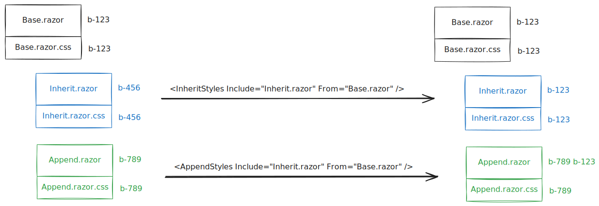

# Flexible style isolation for Razor components

Consider this scenario: You've got a `CoolButton.razor` component that contains
a considerable amount of styles. Now you want to add another, very specific
button... that shares the common behavior with the `CoolButton.razor`! The
markup is similar, with some additions here and there. But thanks to the
style isolation, you'd have to duplicate the *whole* stylesheet to make the
styles apply to your new component. Or, alternatively, define a common, fixed
CSS scope in your project file.

What if you could delegate defining a custom CSS scope to the build? Wouldn't
that be nice?

You're in luck, because that's *exactly* what this package does.

## Usage

Simply add a reference to `Swallow.Build.StyleIsolation` to your project and
define some `InheritStyles` or `AppendStyles` items, each with an `From`
attribute pointing to the component to inherit the styles from.

```xml
<ItemGroup>
  <PackageReference Include="Swallow.Build.StyleIsolation" PrivateAssets="all" ExcludeAssets="Runtime" />
  <InheritStyles Include="Components/SpecificButton.razor" From="Components/CoolButton.razor" />

  <!-- Or, alternatively: -->
  <AppendStyles Include="Components/SpecificButton.razor" From="Components/CoolButton.razor" />
</ItemGroup>
```

Note that you don't actually have to make one `SpecificButton` inherit from
`CoolButton` - it's just the most likely case. The build task will work without
it no problems.

## Exact behavior

In case you don't know yet, the style isolation generates a unique tag per
Razor component with a stylesheet and modifies both so that:

1. All plain HTML tags rendered by the component include that tag as attribute
2. All CSS selectors in the stylesheet match on that specific attribute

When using `AppendStyles`, the attribute rendered by the included component will
contain *both* the tag for the component itself as well as the tag for the
component specified by `From`, while the included component's stylesheet will
still match on the original tag.

When using `InheritStyles`, the attribute rendered by the included component
will be *exactly the same* as for the component specified by `From` and all
the selectors for the included component's stylesheet will match on that
attribute instead.



Run the [example project](./test/Swallow.Build.StyleIsolation.ExampleProject/Swallow.Build.StyleIsolation.ExampleProject.csproj)
and take a look inside the generated `out/` folder to see the exact effects in
the generated files.
